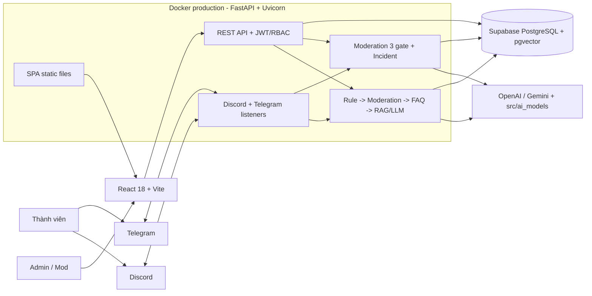

# Kiến trúc THO

> Cập nhật theo code trên nhánh `QA` ngày 01/09/2026. Bản chi tiết, gồm các luồng AI, moderation, dữ liệu và deployment, nằm tại [docs/architecture_diagram.md](docs/architecture_diagram.md).

THO (Triage, Help, Oversight) là trợ lý quản lý cộng đồng học tập trên Discord và Telegram. Một tiến trình FastAPI khởi tạo API, hai platform listener và phục vụ bản React/Vite đã build. Supabase PostgreSQL + pgvector là source of truth duy nhất của runtime production.

## Sơ đồ tổng quan

## Thành phần runtime

| Thành phần | Công nghệ | Trách nhiệm |
|---|---|---|
| Web dashboard | React 18, Vite, React Router, TanStack Query | Dashboard, moderation, FAQ/knowledge, AI sandbox, EXP, người bán và quản lý Mod |
| API | FastAPI, Pydantic, Uvicorn | REST API, JWT/RBAC, rate limit, CORS, security headers và phục vụ SPA production |
| Chat orchestrator | Python, LangChain | `Rule -> Moderation -> FAQ -> RAG/LLM`, scope guard và câu trả lời tiếng Việt |
| Moderation | Fast filter, context review, reviewed-case retrieval, LangGraph sandbox | Phát hiện rủi ro đa ngôn ngữ, giảm cảnh báo trùng và tạo incident |
| Platform adapters | discord.py, Telegram Bot API | Nhận tin người thật, trả lời bot, reaction EXP, trade và moderation alert |
| Data layer | Supabase PostgreSQL, psycopg2 pool, pgvector | Message, incident, audit, auth, FAQ, knowledge, embedding, EXP và trade |
| Model layer | OpenAI, Gemini tùy cấu hình, `src/ai_models` | Moderation có schema, embedding, reranking, relevance gate và LLM hội thoại |
| Delivery | GitHub Actions, Docker, Railway | Ruff, pytest, frontend build, Docker build và deploy một container non-root |

## Nguyên tắc kiến trúc

1. Tin nhắn bot, webhook, application và system bị loại trước moderation, thống kê cộng đồng và EXP.
2. AI chỉ phân tích, giải thích và đề xuất. Xóa tin, timeout, kick và ban chỉ chạy sau khi Admin/Mod xác nhận.
3. FAQ chỉ trả nội dung đã duyệt. RAG phải qua retrieval, reranking và relevance gate trước khi trả nguồn.
4. Runtime không fallback sang SQLite khi Supabase lỗi. SQLite chỉ được dùng trong unit test có cấu hình rõ ràng.
5. EXP chỉ phản ánh đóng góp tích cực, không được dùng làm chỉ số uy tín người bán.
6. Review người bán chỉ được gắn giao dịch xác thực khi buyer và seller cùng xác nhận; AI không chứng nhận an toàn và không đưa tư vấn pháp lý/tài chính.

## Giới hạn hiện tại

- Runtime production đang được cấu hình cho một cộng đồng Discord/Telegram. Các bảng có `community_id`, nhưng connector, biến môi trường và quy trình provision chưa hoàn thiện cho multi-tenant.
- Đăng ký dashboard tạo tài khoản Admin, không tạo community, bot configuration hay tenant mới. Tài khoản mới vẫn truy cập dữ liệu của cộng đồng đang cấu hình.
- Rate limiter hiện lưu trong bộ nhớ tiến trình, phù hợp deployment một replica; cần Redis hoặc storage phân tán nếu scale ngang.

## Tài liệu liên quan

- [Sơ đồ và luồng kỹ thuật chi tiết](docs/architecture_diagram.md)
- [Luồng dữ liệu Supabase](docs/SUPABASE_DATA_FLOW.md)
- [Moderation và chatbot pipeline](docs/community_pipeline.md)
- [Model pipeline](src/ai_models/README.md)
