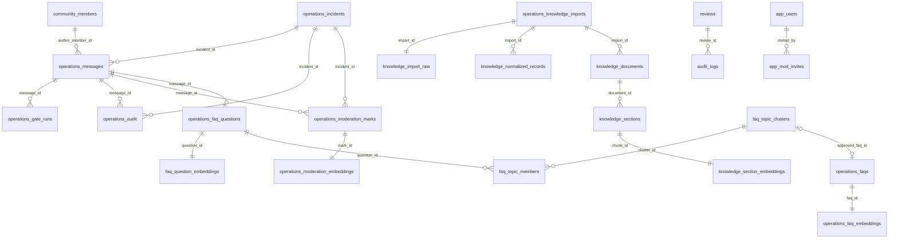

# Sơ đồ dữ liệu Supabase và luồng xử lý

Supabase là nguồn dữ liệu duy nhất của runtime. SQLite chỉ được phép dùng trong unit test có đường dẫn database tạm thời được truyền trực tiếp.

## Quan hệ chính

## Bảng luồng từng chức năng

| Chức năng | Input | Cổng/bước xử lý | Dữ liệu lưu tại Supabase | Output sử dụng |
|---|---|---|---|---|
| Nhận tin nhắn realtime | Discord/Telegram message | Chuẩn hóa platform, community, channel, author và timestamp | `community_members`, `operations_messages` | Input chung cho moderation và chatbot |
| Gate 1 fast filter | Tin nhắn normalized | Policy active, trigger terms, pattern nhanh | Mỗi lần chạy lưu `operations_gate_runs` với `gate=fast_filter` | Candidate an toàn hoặc cần context review |
| Gate 2 context review | Tin nhắn hiện tại và tối đa 12 tin trong 10 phút | Phân tích ngữ cảnh; dùng LLM khi cấu hình bật | `operations_gate_runs` với `gate=context_review`; context gốc ở `operations_messages` | Quyết định allow/warn/hide/hold_for_review |
| Gate 3 case memory | Candidate không an toàn | Embedding shortlist case cùng category; case gần nhưng chưa chắc qua LLM xác nhận tương đương | `operations_moderation_marks`, `operations_moderation_embeddings`, kết quả gate tại `operations_gate_runs` | Case mới gửi Admin/Telegram; case đã duyệt tương đương không gửi lặp nhưng vẫn lưu audit |
| Incident và audit | Kết quả vượt ba gate | Gom message cùng incident, không tự xóa/ban/timeout | `operations_incidents`, `operations_messages.incident_id`, `operations_audit` | Admin/Mod xem và quyết định hành động |
| Admin/Mod ghi nhớ moderation | Incident được Admin/Mod resolve | Chuẩn hóa text, tạo embedding, lưu lý do/người duyệt/thời gian | `operations_moderation_marks`, `operations_moderation_embeddings` | Gate 3 dùng cho các tin nhắn sau |
| Member tag chatbot | Câu hỏi an toàn sau Rule và Moderation | FAQ match trước; câu chưa được FAQ giải quyết mới được ghi ở nhánh RAG/LLM fallback khi `track_question` bật | `operations_faq_questions` | Dataset câu hỏi chưa được FAQ hiện tại giải quyết |
| Gom chủ đề FAQ | Câu hỏi vừa lưu | Embedding truy xuất top candidate; similarity từ 0,55 đến dưới 0,95 phải qua LLM xác nhận cùng intent | `faq_question_embeddings`, `faq_topic_clusters`, `faq_topic_members` | Một topic đại diện cho nhiều cách hỏi tương đương |
| Top 10 FAQ cần bổ sung | Các topic trạng thái `open` | Sắp xếp `question_count DESC`, sau đó `updated_at DESC` | View `faq_top_10_topics` | API `GET /api/v1/faq-top-topics`; Admin thấy 10 chủ đề được hỏi nhiều nhất |
| Admin duyệt FAQ | Topic được chọn và câu trả lời do Admin nhập | Kiểm tra FAQ gần nghĩa, tạo embedding câu hỏi FAQ | `operations_faqs`, `operations_faq_embeddings`; cluster chuyển `approved` | Lần hỏi sau ưu tiên FAQ, không tốn RAG/LLM |
| Rule/command | `/help`, `/rule`, `/event` và command Admin quản lý | Deterministic command routing | `operations_policies`, `operations_command_content` | Trả lời ngay, không gọi FAQ/RAG/LLM |
| Import tài liệu | JSON/JSONL/CSV/TSV/XLSX/YAML/HTML/MD/TXT/DOCX/PDF tối đa 5 MB | Parse theo định dạng, chống archive bomb, làm sạch, field aliases, semantic extraction tùy cấu hình và canonical validation | `operations_knowledge_imports`, `knowledge_import_raw`, `knowledge_normalized_records` | Nguồn truy vết đầy đủ từ raw đến document |
| Chunk và embedding RAG | Knowledge normalized | Chia chunk tối đa khoảng 1.400 ký tự, embedding `text-embedding-3-small` | `knowledge_documents`, `knowledge_sections`, `knowledge_section_embeddings` | pgvector candidate retrieval |
| RAG trả lời | Câu hỏi không khớp FAQ | Vector retrieval, reranking, relevance gate | Query log/audit có thể đối chiếu từ message; nguồn nằm trong knowledge tables | Trả `[RAG]` kèm tài liệu trích dẫn; nguồn yếu thì không trả bừa |
| LLM trả lời chung | Câu không cần tài liệu như tên bot/ngày giờ hoặc fallback RAG không bắt buộc nguồn | Intent routing, scope guard, LLM có giới hạn và chuẩn hóa output tiếng Việt | Chỉ ghi `operations_faq_questions` ở fallback có `track_question`; message nền tảng nằm ở `operations_messages` | Trả `[LLM]` hoặc `[Hệ thống]`, không giả citation RAG |
| Review moderation độc lập | Member submission qua API moderation | Model moderation, Admin/Mod review | `reviews`, `audit_logs` | Hàng đợi review và lịch sử quyết định không sửa được từ member |
| Dashboard auth | Tài khoản Admin/Mod | Password/Google auth, role check, token revocation | `app_users`, `app_mod_invites`, `app_auth_revocations` | Bảo vệ API quản trị |

## Quy tắc source of truth

- Không đọc hoặc ghi `data/app.db` trong runtime có `FAQ_PG_DSN`.
- Không fallback sang SQLite khi Supabase lỗi; request phải báo lỗi để tránh hiển thị dữ liệu cũ.
- Raw, normalized, chunk và embedding là bốn lớp riêng, liên kết bằng foreign key.
- Không dùng `app_users` làm member Discord/Telegram. Member platform nằm trong `community_members`.
- Không tự động publish FAQ. LLM chỉ gom intent và đặt nhãn topic; câu trả lời phải do Admin/Mod duyệt.
- Không tự động tác động message/member sau moderation. AI chỉ tạo incident/cảnh báo; xóa, timeout, kick hoặc ban phải có xác nhận Admin/Mod.

## Backup và rollback

Schema trước migration được sao lưu trong Supabase tại `p232_backup_20260819_before_runtime_v2`.
