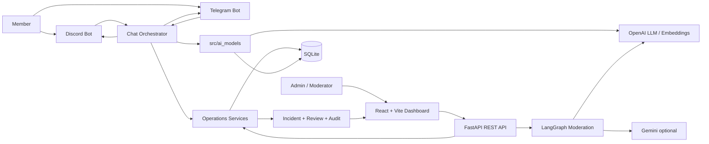
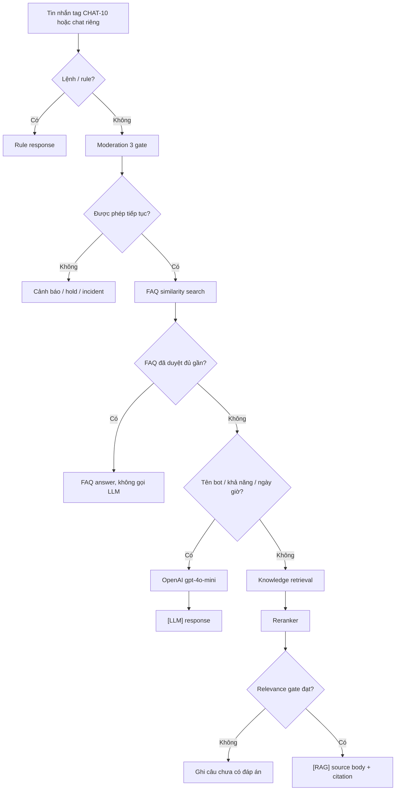
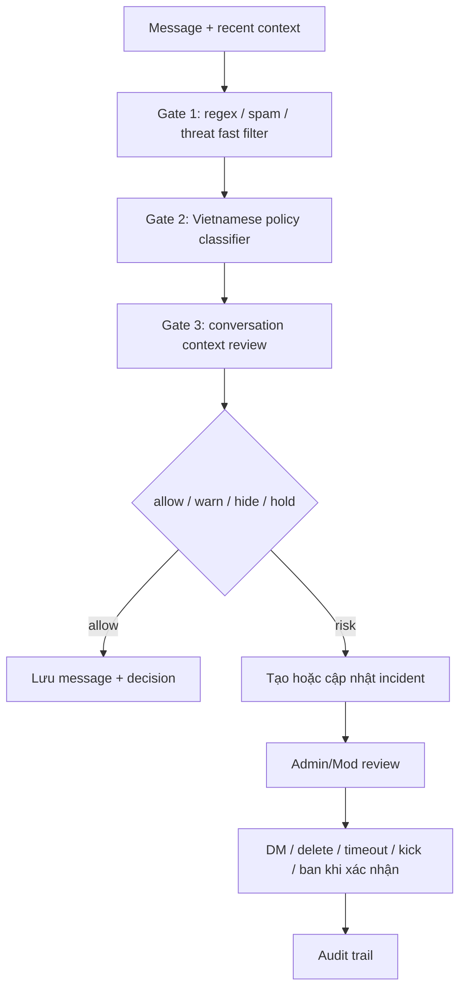
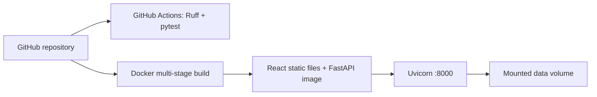
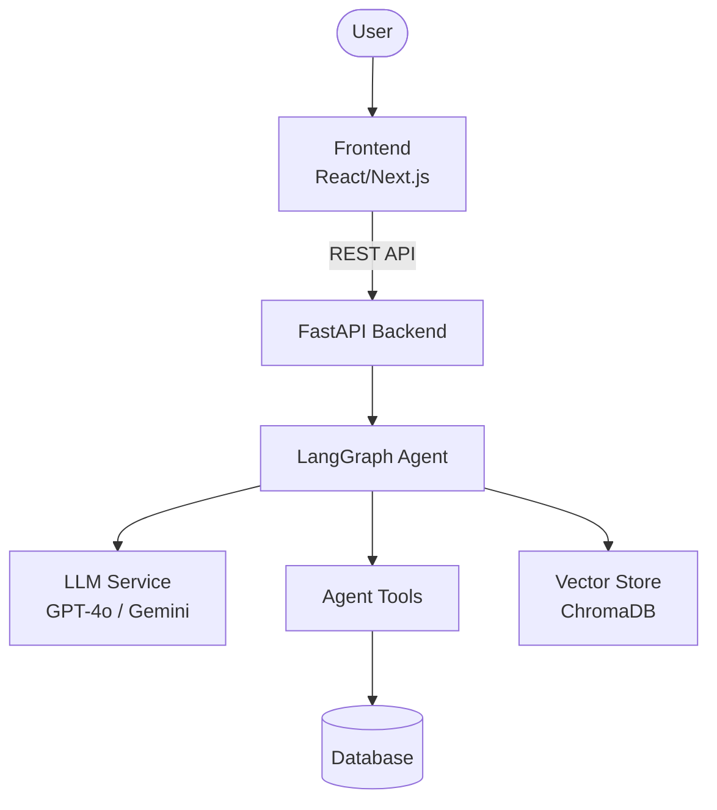
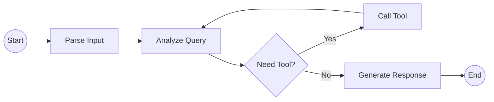

# Architecture Diagram

## Tổng quan CHAT-10

CHAT-10 nhận dữ liệu từ Discord, Telegram hoặc web/API. FastAPI khởi tạo bot listener và các service dùng chung; SQLite lưu message, incident, FAQ, knowledge, audit và metadata embedding. LLM chỉ được gọi ở các nhánh đã định nghĩa, còn RAG phải qua reranking và relevance gate trước khi trả nguồn.

## Luồng hỏi đáp

FAQ và RAG chỉ chạy khi bot được tag trong group hoặc nhận tin nhắn riêng. Tin nhắn group bình thường chỉ chạy moderation realtime.

## Luồng moderation

Endpoint `/api/v1/moderation/submit` có thêm workflow LangGraph chuyên biệt: Context Agent, Policy Agent, Risk Agent, Safety Gate, Decision Agent và deterministic guardrail.

## Thành phần

| Thành phần | Vị trí | Trách nhiệm |
|---|---|---|
| FastAPI app | `backend/main.py` | Lifespan, REST API, CORS, static frontend và bot listeners |
| Chat orchestrator | `backend/services/chat_orchestrator.py` | Rule, moderation, FAQ, LLM/RAG routing và response labels |
| Operations pipeline | `backend/services/operations_pipeline.py` | Ba gate moderation và incident orchestration |
| Model pipeline | `src/ai_models/` | Routing contracts, FAQ, reranking, relevance, citation, moderation memory |
| Operations store | `backend/services/operations_store.py` | SQLite persistence, retrieval, FAQ suggestions, analytics và audit |
| Platform adapters | `backend/services/discord/`, `backend/services/telegram/` | Nhận/gửi message, mention/private-chat detection và alerts |
| Admin dashboard | `frontend/` | Review, incident, knowledge, FAQ và analytics UI |
| Eval | `eval/`, `tests/` | Manual reproducible cases, unit và integration tests |

## Dữ liệu và lưu trữ

| Dữ liệu | Nơi lưu | Ghi chú |
|---|---|---|
| Runtime records | SQLite theo `DATABASE_URL` | Message, incident, policy, FAQ, knowledge, audit |
| File upload gốc | `data/knowledge_uploads/` | Archive của tài liệu import |
| Data contracts | `data/00_inbox` đến `data/50_indexes` | Quy định raw, normalized, chunks, embeddings và indexes |
| AI usage logs | `.ai-log/session.jsonl` | Hook ghi local và submit Phoenix |
| Secret | `.env` | Không commit; `.env.example` chỉ chứa placeholder |

## Retrieval và model

- `KNOWLEDGE_EMBEDDING_ENABLED=true`: dùng OpenAI embedding và cache vector trong SQLite.
- Embedding không bật hoặc provider lỗi: dùng deterministic lexical/concept retrieval.
- Candidate được rerank và qua relevance gate trong `src/ai_models`.
- Runtime knowledge trả nội dung canonical trực tiếp, không dùng LLM viết dài thêm.
- General conversation dùng `gpt-4o-mini`; nếu API lỗi, response được ghi nhãn `[Hệ thống]`, không giả là LLM.

## Deployment

Docker build frontend bằng Node 22, cài Python dependencies trên Python 3.11, chạy production bằng non-root user và expose health check `/health`.

## Quyết định an toàn

- API keys chỉ đọc từ environment; không đưa vào source hoặc log.
- Hành động moderation nhạy cảm yêu cầu Admin xác nhận.
- Relevance gate chặn citation từ tài liệu yếu.
- LLM không được tự bịa dữ liệu cá nhân, dự án hoặc sự kiện hiện tại ngoài system context.
- Moderation memory chỉ chống review trùng và cung cấp bằng chứng; không tự ban/kick/delete.

<!-- Sơ đồ starter template cũ được giữ ẩn để tránh thao tác replace file bị Windows khóa.

## System Overview

## Agent Flow

## Component Details

| Component | Technology | Purpose |
|-----------|-----------|---------|
| Frontend | React/Next.js | User interface |
| Backend | FastAPI | API server |
| Agent | LangGraph | AI agent orchestration |
| LLM | OpenAI/Gemini | Language model |
| Database | PostgreSQL/SQLite | Data persistence |
| Vector Store | ChromaDB | RAG / embeddings |
-->
