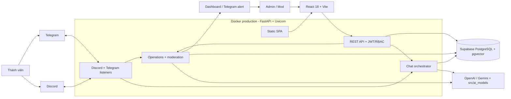
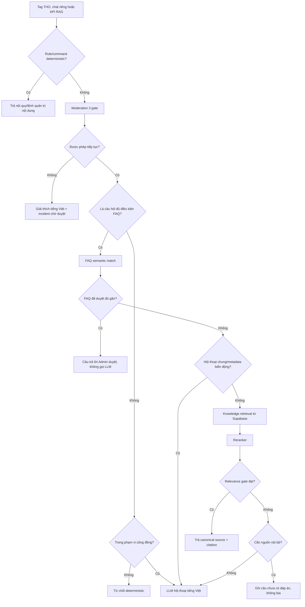
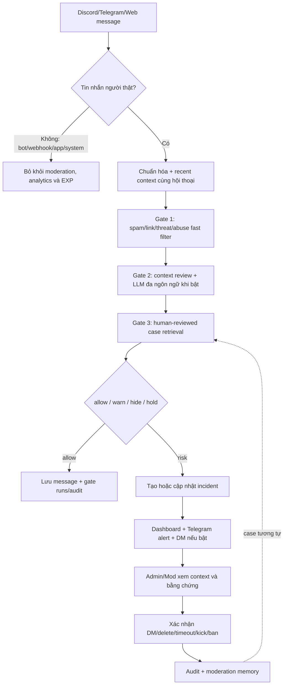
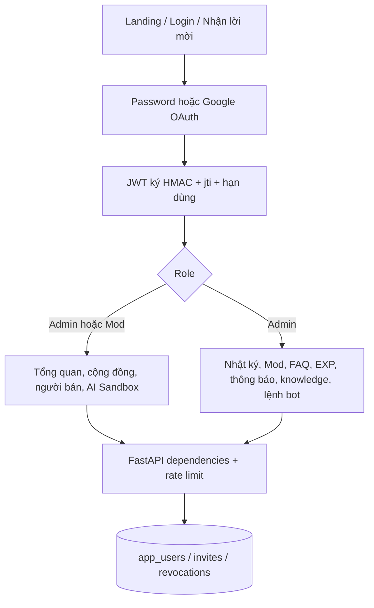
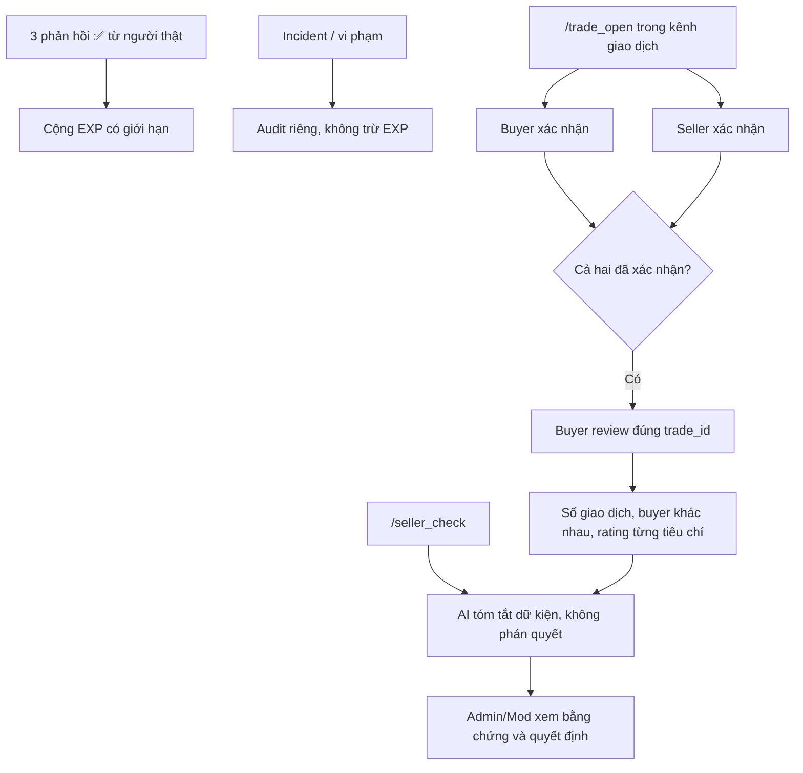
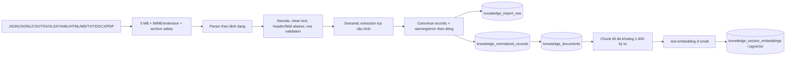
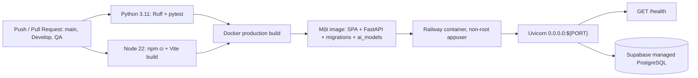

# Kiến trúc hệ thống THO

> Cập nhật theo code trên nhánh `QA` ngày 01/09/2026. Đây là tài liệu kiến trúc chính thức của runtime hiện tại.

THO (Triage, Help, Oversight) nhận dữ liệu từ Discord, Telegram và dashboard web. Một tiến trình FastAPI khởi tạo REST API, Discord listener, Telegram listener và phục vụ bản React/Vite đã build. Supabase PostgreSQL + pgvector là source of truth duy nhất của production; không có ChromaDB hay SQLite fallback trong runtime.

### Vòng đời ứng dụng

1. FastAPI làm nóng connection pool PostgreSQL, khởi tạo auth store, review store và operations pipeline.
2. Startup maintenance tùy cấu hình dọn demo data và incident trùng.
3. Discord và Telegram listener chạy nền, dùng chung store và moderation pipeline với API.
4. Production phục vụ `frontend/dist`; development dùng Vite dev server và proxy `/api`.
5. Shutdown dừng cả hai listener và đóng toàn bộ PostgreSQL pool.

## Luồng hỏi đáp

FAQ và RAG chỉ chạy khi bot được tag trong group, nhận chat riêng hoặc được gọi qua API. Tin nhắn group bình thường chỉ chạy moderation realtime. LLM hội thoại có persona cute nhưng cảnh báo, từ chối và nội dung an toàn luôn dùng giọng rõ ràng; response do model tạo được chuẩn hóa về tiếng Việt.

## Luồng moderation

Gate 3 chỉ giảm cảnh báo lặp; case cũ không được phép biến thành hành động tự động cho message mới. Endpoint AI Sandbox `/api/v1/moderation/submit` dùng workflow LangGraph riêng gồm Context Agent, Policy Agent, Risk Agent, Safety Gate, Decision Agent và deterministic guardrail. OpenAI là provider chính; Gemini có thể chọn bằng cấu hình.

## Dashboard, xác thực và phân quyền

Mọi operations API yêu cầu đăng nhập; từng endpoint tiếp tục kiểm tra vai trò. Mật khẩu dùng PBKDF2-HMAC-SHA256 với salt và 600.000 vòng. Đăng ký hiện chỉ tạo Admin dashboard trong tenant đang cấu hình, chưa provision một cộng đồng mới.

## Luồng EXP và người bán

- EXP chỉ cộng từ sự kiện đóng góp dương; bot, tự reaction và event trùng không được tính.
- Review chỉ mang nhãn giao dịch xác thực khi buyer và seller đã cùng xác nhận; mỗi `trade_id` có tối đa một review.
- AI chỉ nhận chỉ số tổng hợp, không nhận Discord User ID, và không được kết luận “an toàn”, “lừa đảo” hoặc đưa tư vấn pháp lý/tài chính.
- Mốc mặc định `3` giao dịch và `3` buyer chỉ xác định đủ cỡ mẫu để hiển thị lịch sử, không phải huy hiệu bảo đảm.
- Từ `5` review trong `24` giờ cho cùng seller được gắn cờ burst để Admin/Mod kiểm tra, không bị tự động loại.

## Thành phần

| Thành phần | Vị trí | Trách nhiệm |
|---|---|---|
| FastAPI app | `backend/main.py` | Lifespan, REST API, request limit 12 MB, security headers, CORS, static frontend và bot listeners |
| Auth/RBAC | `backend/api/auth_routes.py`, `backend/services/auth_service.py` | Password/Google login, JWT, Admin/Mod, invite và token revocation |
| Chat orchestrator | `backend/services/chat_orchestrator.py` | Rule, moderation, FAQ, LLM/RAG routing và response labels |
| Operations pipeline | `backend/services/operations_pipeline.py` | Ba gate moderation và incident orchestration |
| Model pipeline | `src/ai_models/` | Routing contracts, FAQ, reranking, relevance, citation, moderation memory |
| Operations store | `backend/services/operations_store.py` | Supabase persistence, retrieval, FAQ suggestions, analytics và audit |
| Knowledge importer | `backend/services/knowledge_importer.py` | Parse, làm sạch, chuẩn hóa, kiểm giới hạn và archive raw import |
| EXP và seller trust | `backend/services/operations_store.py`, `frontend/src/pages/ExperiencePage.jsx`, `frontend/src/pages/SellerTrustPage.jsx` | EXP dương, giao dịch xác thực, review từng tiêu chí và human review |
| Platform adapters | `backend/services/discord/`, `backend/services/telegram/` | Nhận/gửi message, mention/private-chat detection và alerts |
| Admin dashboard | `frontend/` | Route lazy loading, role gates, moderation, knowledge, FAQ, EXP, seller và analytics UI |
| Eval | `eval/`, `tests/` | Manual reproducible cases, unit và integration tests |

## Dữ liệu và lưu trữ

| Dữ liệu | Nơi lưu | Ghi chú |
|---|---|---|
| Runtime records | Supabase PostgreSQL | Message, member, incident, policy, FAQ, knowledge, audit và gate runs |
| Dashboard identity | `app_users`, `app_mod_invites`, `app_auth_revocations` | Tách khỏi member Discord/Telegram; role chỉ gồm Admin và Mod |
| EXP | `member_reputation_events` (legacy ledger) + API `/admin/experience` | Chỉ tổng hợp event dương; penalty cũ không được tính vào EXP |
| Giao dịch người bán | `operations_trade_cases`, `operations_seller_reviews`, `operations_seller_assessments` | Xác nhận hai phía, verified review và quyết định Admin/Mod |
| Raw upload | `knowledge_import_raw` trong Supabase | Lưu bytes, checksum và metadata của file import |
| Normalized records | `knowledge_normalized_records` trong Supabase | Bản chuẩn hóa liên kết với `import_id` |
| Chunks và embeddings | `knowledge_sections`, `knowledge_section_embeddings` và các bảng embedding Supabase | pgvector dùng cho retrieval; không đọc file raw trực tiếp |
| Data contracts/examples | `data/00_inbox` đến `data/50_indexes` | Hợp đồng, ví dụ và hướng dẫn cho Data team; không phải runtime store |
| AI usage logs | `.ai-log/session.jsonl` | Hook ghi local và submit Phoenix |
| Secret | `.env` | Không commit; `.env.example` chỉ chứa placeholder |

### Luồng import và chuẩn hóa knowledge

Importer giới hạn 10.000 record, 512 cột spreadsheet, 500 trang PDF, 2.000 file con và 50 MB sau giải nén Office để giảm rủi ro file bomb và tiêu tốn tài nguyên. PDF scan không có text layer sẽ sinh cảnh báo thay vì bịa nội dung OCR.

## Retrieval và model

- `KNOWLEDGE_EMBEDDING_ENABLED=true`: dùng OpenAI embedding và lưu vector trong các bảng pgvector của Supabase.
- Embedding không bật hoặc provider lỗi: dùng deterministic lexical/concept retrieval trên dữ liệu Supabase; không tự chuyển runtime sang SQLite.
- Candidate được rerank và qua relevance gate trong `src/ai_models`.
- Runtime knowledge trả nội dung canonical trực tiếp, không dùng LLM viết dài thêm.
- General conversation dùng `gpt-4o-mini`; nếu API lỗi, response được ghi nhãn `[Hệ thống]`, không giả là LLM.
- Moderation LLM nhận yêu cầu giải thích cụm từ/ngữ cảnh gây xung đột, hỗ trợ input đa ngôn ngữ và chuẩn hóa output hiển thị về tiếng Việt.

## Deployment

Docker có ba stage: build frontend bằng Node 22, build virtualenv bằng Python 3.11 và copy artifact vào runtime Python 3.11 tối giản. Railway cấp `PORT`; mặc định local là `8000`. Production không cần local data volume vì dữ liệu nằm trên Supabase.

## Quyết định an toàn

- API keys chỉ đọc từ environment; không đưa vào source hoặc log.
- API body bị chặn trên 12 MB; knowledge upload bị chặn trên 5 MB và parser có giới hạn chống file/archive bomb.
- Header production gồm HSTS, `X-Content-Type-Options`, `X-Frame-Options`, referrer policy và permissions policy.
- Hành động moderation nhạy cảm yêu cầu Admin/Mod đăng nhập, đúng role và xác nhận case.
- Endpoint tốn tài nguyên có sliding-window rate limit theo tài khoản.
- Relevance gate chặn citation từ tài liệu yếu.
- LLM không được tự bịa dữ liệu cá nhân, dự án hoặc sự kiện hiện tại ngoài system context.
- Moderation memory chỉ chống review trùng và cung cấp bằng chứng; không tự ban/kick/delete.
- Tin nhắn bot/webhook/application/system bị loại trước moderation, analytics và EXP.
- Điểm EXP không được dùng để suy luận độ tin cậy người bán.
- Seller summary luôn hiển thị cỡ mẫu; AI không có quyền chứng nhận, kết tội hoặc thực hiện action.

## Giới hạn và hướng mở rộng

- Runtime hiện cấu hình cho một community. Dù schema đã có `community_id`, bot token/channel và dữ liệu dashboard chưa được cô lập theo tenant end-to-end.
- `/auth/register` chỉ tạo tài khoản Admin trong community hiện tại; chưa tạo bot configuration, tenant hay community mới.
- Rate limiter nằm trong bộ nhớ và phù hợp một replica; cần Redis hoặc distributed store trước khi scale ngang.
- Discord và Telegram listener chạy cùng API process. Khi tăng tải cần tách worker, lock phân tán và queue sự kiện.
- Dashboard chưa phải hệ thống chứng minh danh tính người bán; quyết định liên quan tiền bạc vẫn cần Admin/Mod kiểm tra bằng chứng ngoài hệ thống khi cần.
