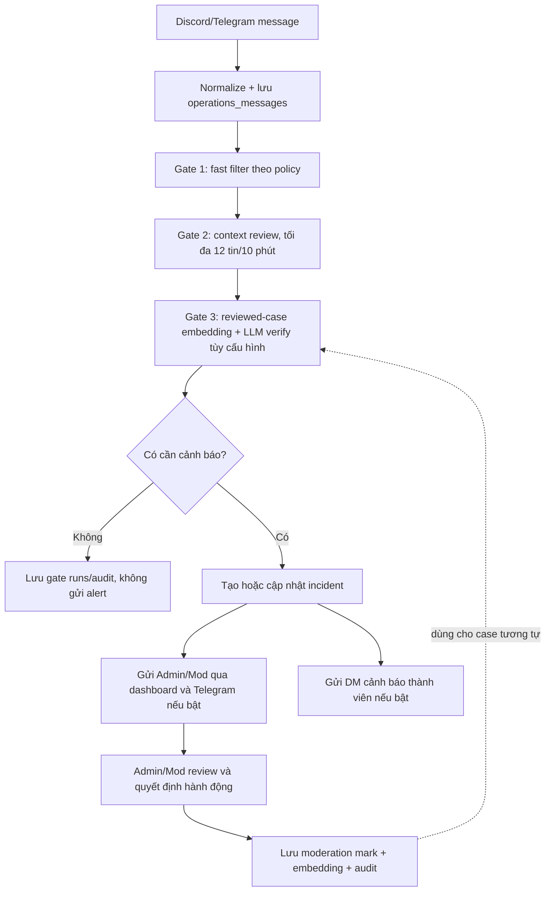
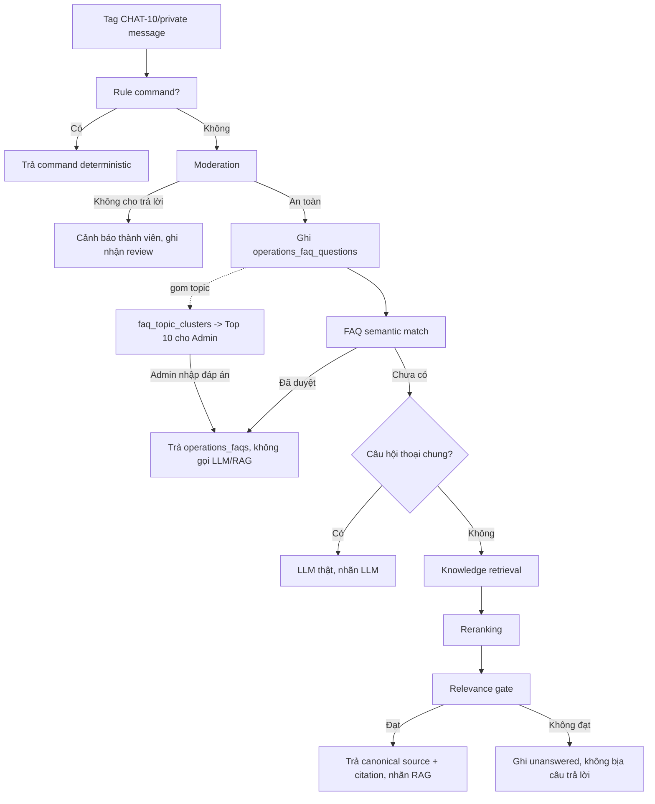

# Discord + Telegram operations pipeline

Runtime sử dụng Supabase PostgreSQL + pgvector làm source of truth. `data/` chỉ chứa contract/example để chuẩn hóa input, không phải nơi đọc dữ liệu production.

## Tin nhắn realtime không tag chatbot

Gate chỉ giúp giảm cảnh báo sai và cảnh báo trùng. AI không tự xóa message, timeout, kick hoặc ban; mọi tác động trực tiếp do Admin/Mod xác nhận.

## Tin nhắn tag chatbot hoặc chat riêng

## Nơi lưu dữ liệu

| Bước | Bảng Supabase |
|---|---|
| Message, context | `community_members`, `operations_messages` |
| Ba gate và audit | `operations_gate_runs`, `operations_incidents`, `operations_audit` |
| Case đã Admin/Mod xác nhận | `operations_moderation_marks`, `operations_moderation_embeddings` |
| FAQ analytics và Top 10 | `operations_faq_questions`, `faq_question_embeddings`, `faq_topic_clusters`, `faq_topic_members`, view `faq_top_10_topics` |
| FAQ đã duyệt | `operations_faqs`, `operations_faq_embeddings` |
| Knowledge import và RAG | `operations_knowledge_imports`, `knowledge_import_raw`, `knowledge_normalized_records`, `knowledge_documents`, `knowledge_sections`, `knowledge_section_embeddings` |

Discord listener nhận message realtime; Telegram nhận alert khi decision vượt ngưỡng và được bật trong environment. Mọi decision và feedback vẫn đi qua Admin/Mod và được ghi audit trail.
