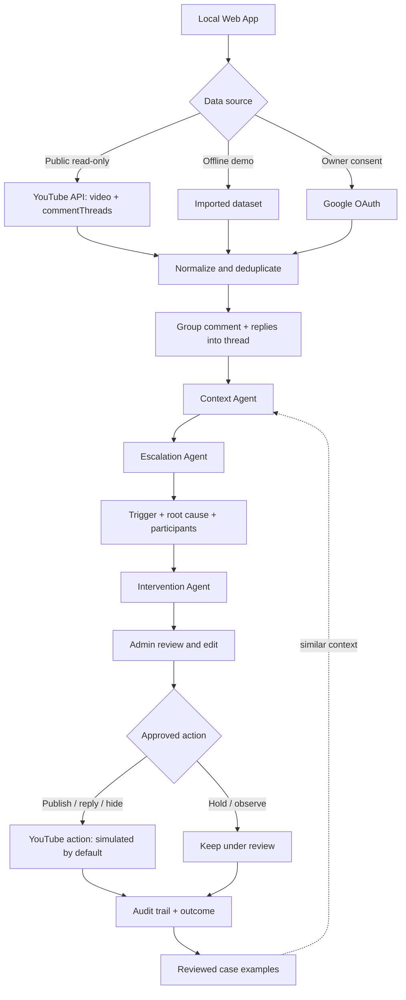

# Community Health pipeline

Public API mode never calls a YouTube write endpoint. The UI labels the default action as `SIMULATED ACTION`; real channel actions require explicit OAuth configuration and Admin approval.
