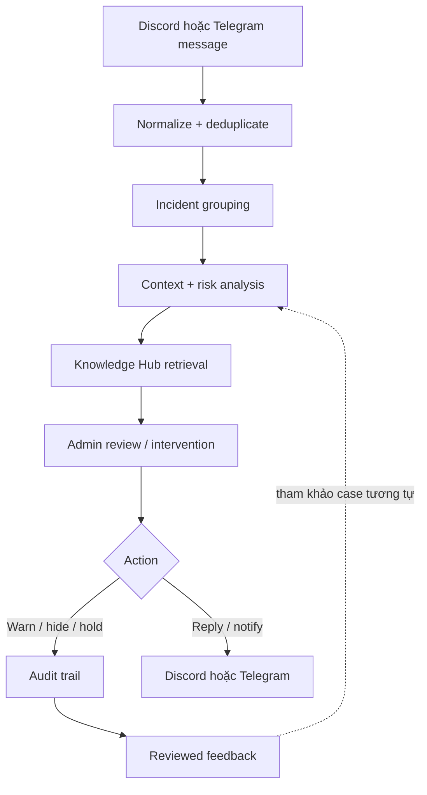

# Discord + Telegram operations pipeline

Discord listener nhận message realtime, nhóm incident theo channel/thread, truy xuất Knowledge Hub rồi mới đề xuất hành động. Telegram chỉ nhận cảnh báo khi risk vượt ngưỡng cấu hình; mọi quyết định vẫn được lưu vào audit trail.
