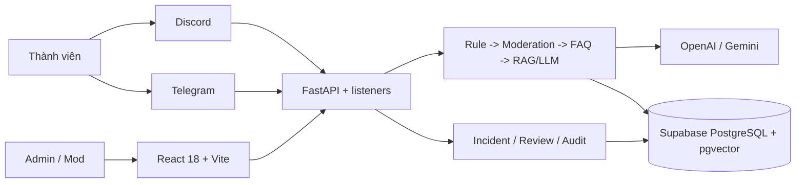

## Kiến trúc hệ thống

> Bản đầy đủ và luôn được ưu tiên nằm tại [../../architecture_diagram.md](../../architecture_diagram.md).

### Sơ đồ tổng quan

## Components

### 1. Frontend (React/Vite)

- **Mục đích:** Landing, đăng nhập và dashboard Admin/Mod.
- **Tính năng:** Incident, community analytics, AI Sandbox, FAQ/knowledge, EXP, seller và bot commands.
- **State:** React hooks và TanStack Query; route được lazy-load và chặn theo role.

### 2. Backend (FastAPI)

- **Mục đích:** REST API, auth/RBAC, business logic, static SPA và vòng đời platform listener.
- **Auth:** Password/Google OAuth, JWT HMAC, Admin/Mod role và token revocation.
- **Safety:** Request limit, security headers, CORS và rate limit cho endpoint tốn tài nguyên.

### 3. AI và orchestration

- Chatbot dùng flow explicit `Rule -> Moderation -> FAQ -> RAG/LLM`.
- AI Sandbox moderation dùng LangGraph với Context, Policy, Risk, Safety Gate và Decision Agent.
- RAG dùng Supabase retrieval, reranking, relevance gate và canonical citation.

### 4. Database

- **Type:** Supabase PostgreSQL
- **Access:** psycopg2 connection pool trong `backend/services/database.py`
- **Migrations:** SQL trong `supabase/migrations/`

### 5. Vector Store

- **Type:** pgvector trong Supabase
- **Embeddings:** OpenAI embeddings
- **Purpose:** RAG / similarity search

## Luồng dữ liệu

1. Discord/Telegram hoặc Frontend gửi input tới FastAPI.
2. Input được chuẩn hóa và ghi vào Supabase nếu là message/runtime event.
3. Tin nhắn realtime không tag bot đi qua Gate 1 fast filter, Gate 2 context review và Gate 3 reviewed-case retrieval.
4. Tin nhắn tag bot/chat riêng đi Rule → Moderation → FAQ → LLM hoặc RAG; RAG đi retrieval → reranking → relevance gate → citation.
5. Admin/Mod quyết định mọi hành động moderation; decision, feedback và embedding được lưu vào Supabase.
6. Production build đóng gói React SPA và FastAPI trong một Docker image non-root rồi chạy trên Railway.

## Design Decisions

| Quyết định | Lựa chọn | Lý do |
|---|---|---|
| Backend | FastAPI | Pydantic contracts, dependency auth và lifecycle rõ ràng |
| Frontend | React 18 + Vite | SPA nhanh, phù hợp dashboard và được FastAPI phục vụ ở production |
| Moderation graph | LangGraph | Có state và guardrail rõ cho AI Sandbox đa agent |
| Runtime database | Supabase PostgreSQL + pgvector | Một source of truth cho dữ liệu quan hệ và vector search |
| Deployment | Một Docker image trên Railway | Đồng bộ frontend/backend, health check và cấu hình bằng environment |
| Human control | Admin/Mod duyệt hành động | AI không tự xóa, timeout, kick, ban hoặc chứng nhận người bán |
