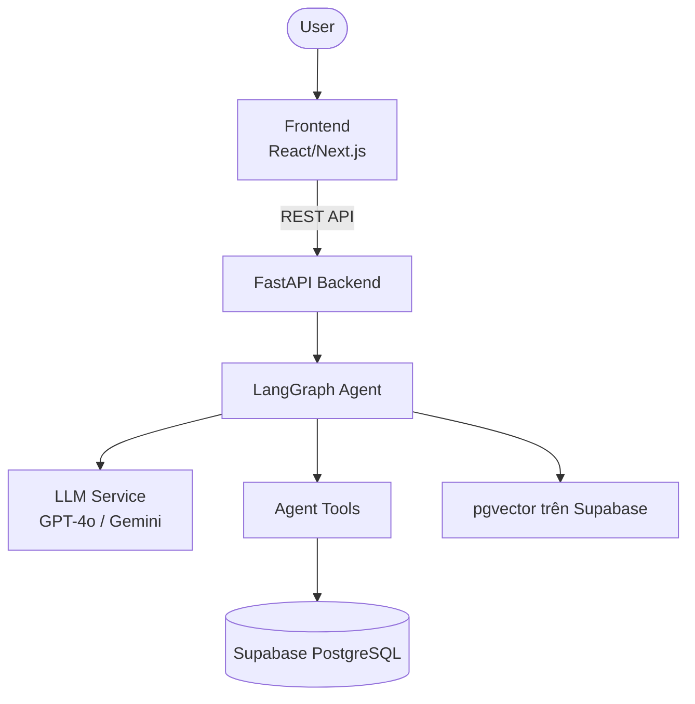

## System Architecture

### Overview Diagram

## Components

### 1. Frontend (React/Vite)

- **Purpose:** User interface cho sản phẩm
- **Key Features:** Responsive, dark mode, realtime
- **State Management:** React hooks / Zustand

### 2. Backend (FastAPI)

- **Purpose:** API server xử lý business logic
- **API Design:** RESTful endpoints
- **Auth:** JWT (nếu cần)

### 3. AI Agent (LangGraph)

- **Agent Type:** ReAct / Plan-and-Execute / Custom
- **State:** TypedDict schema
- **Nodes:** Xử lý từng bước trong pipeline
- **Tools:** Search, calculate, API calls

### 4. Database

- **Type:** Supabase PostgreSQL
- **Access:** DB-API adapter trong `backend/services/database.py`
- **Migrations:** SQL trong `supabase/migrations/`

### 5. Vector Store

- **Type:** pgvector trong Supabase
- **Embeddings:** OpenAI embeddings
- **Purpose:** RAG / similarity search

## Data Flow

1. Discord/Telegram hoặc Frontend gửi input tới FastAPI.
2. Input được chuẩn hóa và ghi vào Supabase nếu là message/runtime event.
3. Tin nhắn realtime không tag bot đi qua Gate 1 fast filter, Gate 2 context review và Gate 3 reviewed-case retrieval.
4. Tin nhắn tag bot/chat riêng đi Rule → Moderation → FAQ → LLM hoặc RAG; RAG đi retrieval → reranking → relevance gate → citation.
5. Admin/Mod quyết định mọi hành động moderation; decision, feedback và embedding được lưu vào Supabase.

## Design Decisions

| Decision | Choice | Reason |
|----------|--------|--------|
| Framework | FastAPI | Async, auto-docs, type-safe |
| Agent | LangGraph | Flexible state machine |
| Database | Supabase PostgreSQL + pgvector | Một source of truth cho runtime và vector search |
| Frontend | Next.js | Full-stack ready |
