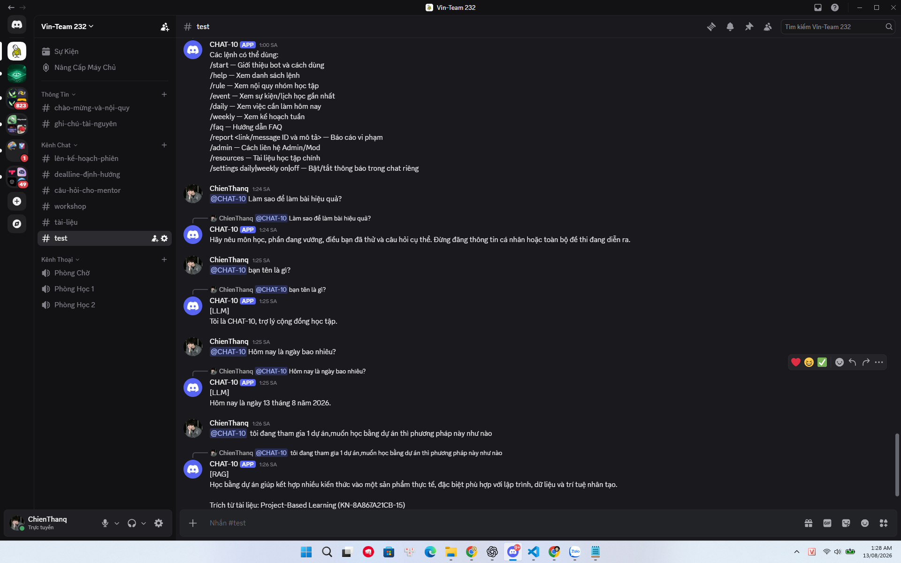

# Evaluation Report

## Bằng chứng Discord Gate 2

Trạng thái: **5/5 case PASS - đã có ảnh test thực tế từ Discord**.

Ảnh được chụp trực tiếp tại kênh `#test` của Discord server `Vin-Team 232` ngày 13/08/2026. Một ảnh chứng minh năm lượt test liên tiếp. Với case `/help`, input nằm ngay phía trên phần ảnh đã chụp và được người thực hiện test xác nhận; output bảng lệnh hiển thị đầy đủ trong ảnh.



| Case | Câu hỏi đã test | Luồng mong đợi | Kết quả thực tế | File ảnh | Trạng thái |
|---|---|---|---|---|---|
| G2-01 | `/help` | Rule | Trả bảng các lệnh có thể dùng | `discord-gate2-real-test-2026-08-13.png` | PASS |
| G2-02 | `Làm sao để làm bài hiệu quả?` | FAQ | Trả đúng hướng dẫn hỏi bài đã duyệt | `discord-gate2-real-test-2026-08-13.png` | PASS |
| G2-03 | `bạn tên là gì?` | LLM | Có nhãn `[LLM]`, bot tự giới thiệu là CHAT-10 | `discord-gate2-real-test-2026-08-13.png` | PASS |
| G2-04 | `Hôm nay là ngày bao nhiêu?` | LLM | Có nhãn `[LLM]`, trả ngày 13/08/2026 | `discord-gate2-real-test-2026-08-13.png` | PASS |
| G2-05 | `tôi đang tham gia 1 dự án,muốn học bằng dự án thì phương pháp này như nào` | RAG | Có nhãn `[RAG]` và citation Project-Based Learning | `discord-gate2-real-test-2026-08-13.png` | PASS |

### Nội dung trích từ ảnh

#### G2-01 - Rule `/help`

```text
User: @CHAT-10 /help

CHAT-10: Các lệnh có thể dùng:
/start — Giới thiệu bot và cách dùng
/help — Xem danh sách lệnh
/rule — Xem nội quy nhóm học tập
/event — Xem sự kiện/lịch học gần nhất
/daily — Xem việc cần làm hôm nay
/weekly — Xem kế hoạch tuần
/faq — Hướng dẫn FAQ
/report <link/message ID và mô tả> — Báo cáo vi phạm
/admin — Cách liên hệ Admin/Mod
/resources — Tài liệu học tập chính
/settings daily|weekly on|off — Bật/tắt thông báo trong chat riêng
```

#### G2-02 - FAQ

```text
User: @CHAT-10 Làm sao để làm bài hiệu quả?

CHAT-10: Hãy nêu môn học, phần đang vướng, điều bạn đã thử và câu hỏi cụ thể.
Đừng đăng thông tin cá nhân hoặc toàn bộ đề thi đang diễn ra.
```

#### G2-03 - LLM tên bot

```text
User: @CHAT-10 bạn tên là gì?

CHAT-10:
[LLM]
Tôi là CHAT-10, trợ lý cộng đồng học tập.
```

#### G2-04 - LLM ngày hiện tại

```text
User: @CHAT-10 Hôm nay là ngày bao nhiêu?

CHAT-10:
[LLM]
Hôm nay là ngày 13 tháng 8 năm 2026.
```

#### G2-05 - RAG có nguồn

```text
User: @CHAT-10 tôi đang tham gia 1 dự án,muốn học bằng dự án thì phương pháp này như nào

CHAT-10:
[RAG]
Học bằng dự án giúp kết hợp nhiều kiến thức vào một sản phẩm thực tế, đặc biệt
phù hợp với lập trình, dữ liệu và trí tuệ nhân tạo.

Trích từ tài liệu: Project-Based Learning (KN-8A867A21CB-15)
```

### Automated tests tham khảo

```text
60 passed, 1 skipped in 2.67s
Ruff (các file model/Gate 2 thay đổi): All checks passed
```

| Tiêu chí | Mục tiêu | Kết quả | Trạng thái |
|---|---:|---:|---|
| Manual Discord cases | Ít nhất 5 | 5 | Đạt |
| Ảnh output thực tế | Output thật cho từng case | 1 ảnh, chứa 5 case | Đạt |
| Automated tests | Test suite pass | 60 pass, 1 skip | Tham khảo |

Kết quả pytest chỉ là bằng chứng bổ sung; yêu cầu 5 manual Discord cases đã được đáp ứng bằng ảnh thực tế phía trên.

<!-- Template báo cáo cũ được giữ ẩn bên dưới; không dùng làm evidence Gate 2.

> Báo cáo đánh giá chất lượng sản phẩm theo tiêu chí BTC.

---

## 1. Metrics

| Metric | Target | Actual | Status |
|--------|--------|--------|--------|
| Response accuracy | >80% | — | ⏳ |
| Response latency | <3s | — | ⏳ |
| User satisfaction | >4/5 | — | ⏳ |
| Test coverage | >60% | — | ⏳ |

## 2. Test Results

### Unit Tests
```
pytest tests/ -v
# Paste output here
```

### Integration Tests
```
# Mô tả test scenarios và kết quả
```

## 3. User Feedback

| User | Feedback | Rating |
|------|----------|--------|
| [User 1] | [feedback] | [1-5] |
| [User 2] | [feedback] | [1-5] |

## 4. Demo Results

- Ngày demo: [YYYY-MM-DD]
- Người tham gia: [số người]
- Feedback chung: [tóm tắt]
- Issues phát hiện: [danh sách]

## 5. Action Items

- [ ] [Cần cải thiện 1]
- [ ] [Cần cải thiện 2]
-->
